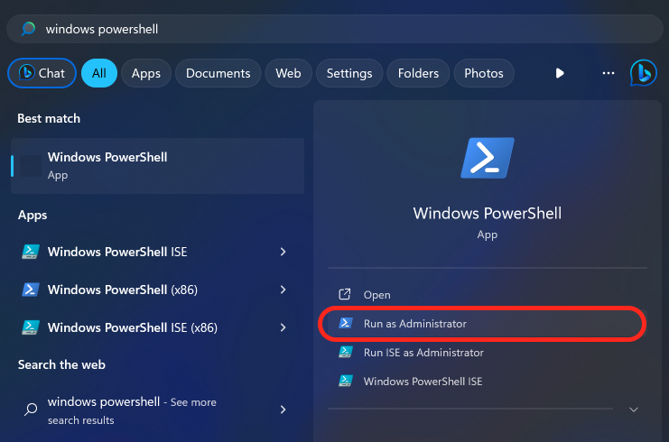

<h1 align="center">
  <br>
  
  
  <br>
  HEI-Vs Engineering School - Typst Thesis Template
  <br>
</h1>

[](https://github.com/tschinz/hevs-typsttemplate-thesis/blob/master/05-pdf/thesis.pdf) [](https://github.com/tschinz/hevs-typsttemplate-thesis/raw/master/05-pdf/thesis.pdf)

A Typst template for the HES-SO//Valais Wallis Bachelor thesis.

> **Warning**
> Disclaimer, this is an unofficial typst template not supported by the HEI-Vs. Use at your own risk, no support is provided for installation or use. You have been warned.

# Table of contents

<p align="center">
  <a href="#features">Features</a> •
  <a href="#getting-started">Getting started</a> •
  <a href="#contributing">Contributing</a> •
  <a href="#credits">Credits</a> •
  <a href="#find-us-on">Find us on</a>
</p>

## Features

[(Back to top)](#table-of-contents)

* Title page with official layout
* Table of contents, Table of figures, Table of tables, Table of listings
* Abstract
* Nice title styles for chapter and appendices
* Chapter table of contents (minitoc)
* Bibliography
* Glossary
* Code highlighting
* Nice default typography settings
* Custom Boxes

## Getting started

[(Back to top)](#table-of-contents)

### Installation

This document is made for typst v0.11.0.

#### MacOS

```bash
# [homebrew](https://brew.sh)
/bin/bash -c "$(curl -fsSL https://raw.githubusercontent.com/Homebrew/install/HEAD/
install.sh)"

# [just](https://just.systems)
brew install just

# [typst](https://github.com/typst/typst)
brew install typst
```

#### Linux & MacOS (via Rust)

```bash
# [rust](https://www.rust-lang.org/tools/install)
curl --proto '=https' --tlsv1.2 -sSf https://sh.rustup.rs | sh

# [just](https://just.systems)
cargo install just

# [typst](https://github.com/typst/typst)
cargo install typst
```

#### Windows

Open a Windows Powershell as Administrator



```powershell
# [chocolatey](https://chocolatey.org)
# ensure to use a administrative powershell
Set-ExecutionPolicy Bypass -Scope Process -Force; [System.Net.ServicePointManager]::SecurityProtocol = [System.Net.ServicePointManager]::SecurityProtocol -bor 3072; iex ((New-Object System.Net.WebClient).DownloadString('https://community.chocolatey.org/install.ps1'))
```

Open a new Windows Powershell as Administrator

```powershell
# [just](https://just.systems)
choco install just

# [typst](https://github.com/typst/typst)
choco install typst

# [vscode](https://code.visualstudio.com/)
choco install vscode vscli

# [git](https://git-scm.com/downloads)
choco install git.install
```

### How to use

1. Modify variables in `01-settings/metadata.typ`

2. Write your thesis there are plugins for VS-Code and Sublimetext available

3. Use the given justfile or typst directly to build the PDF
   
   With the justfile
   
   ```bash
   just
   Available recipes:
    clean                      # cleanup intermediate files
    default                    # List all commands
    info                       # Information about the environment
    install                    # install required sw
    open file_name=doc_name    # open pdf
    pdf file_name=doc_name     # build, rename and copy a typ file to a pdf
    pdf-all file_name=doc_name # build, rename and copy a typ file in all variants
    watch file_name=doc_name   # watch a typ file for continuous incremental build   ```
   ```
   
   With typst directly
   
   ```bash
   typst c main.typ             # compiles thesis to main.pdf
   typst w main.typ             # watches all documents and incrementally compiles to main.pdf
   ```

## Contributing

   [(Back to top)](#table-of-contents)

1. Take a look at the [issues](https://github.com/tschinz/hevs-typsttemplate-thesis/issues) issues with the "Help wanted" tag

2. Choose something or open a new [issue](https://github.com/tschinz/hevs-typsttemplate-thesis/issues)

3. Fork the repo, fix the problem in a branch

4. Rebase your branch if needed

5. Submit a [pull request](https://github.com/tschinz/hevs-typsttemplate-thesis/pulls)

## Help

[(Back to top)](#table-of-contents)

[](https://github.com/tschinz/hevs-typsttemplate-thesis/blob/master/guide-to-typst.pdf) [](https://github.com/tschinz/hevs-typsttemplate-thesis/raw/master/guide-to-typst.pdf)
## Credits

[(Back to top)](#table-of-contents)

* All guys from Typst
* Silvan Zahno

## Find us on

[(Back to top)](#table-of-contents)

* Webpage [hevs.ch](https://www.hevs.ch/synd)
* LinkedIn [HEI Valais-Wallis](https://www.linkedin.com/showcase/school-of-engineering-valais-wallis/)
* Youtube [HES-SO Valais-Wallis](https://www.youtube.com/user/HESSOVS/)
* Twitter [@hessovalais](https://twitter.com/hessovalais)
* Facebook [@hessovalais](https://www.facebook.com/hessovalais)
